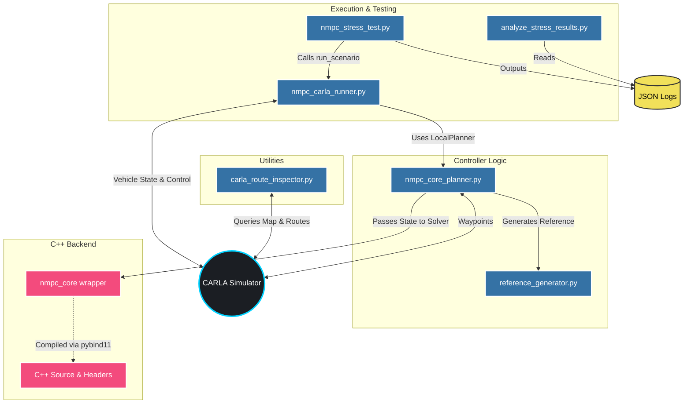

# NMPC CARLA Controller

A high-performance Nonlinear Model Predictive Control (NMPC) core and Local Planner designed for trajectory tracking in the CARLA simulator. This project is an independent engineering implementation inspired by established MPC and NMPC principles. It emphasizes modularity, robustness, and real-time execution for autonomous driving applications.

## Design Goals

* **Real-time execution** suitable for autonomous driving
* **Zero dynamic memory allocation**: Conceptually targeted for low-spec edge devices like Jetson Nano, ensuring no dynamic allocation during the runtime loop.
* **From-scratch math implementation**: Core matrix operations and mathematics are implemented natively from scratch without relying on external open-source libraries.
* **Modular C++ NMPC core** separated from the simulator
* **Python interface** through `pybind11`
* **Easy validation** in CARLA
* **Quantitative evaluation** through repeatable stress-testing

## Architecture & Dependencies

The following dependency graph illustrates the relationship between the Python scripts, the C++ NMPC core, and the CARLA simulator.



## Features
- **High-Performance C++ Backend**: The NMPC solver is written in C++ with performance-oriented optimizations (`-O3`, `-ffast-math`, LTO) for hard real-time constraints.
- **Python Binding**: Seamlessly integrated into Python using `pybind11`, allowing easy interface with the CARLA Python API.
- **Scenario Runner**: Easily run standard randomly generated paths or specific JSON scenarios using `nmpc_carla_runner.py`.
- **Stress Testing Suite**: Built-in tools for stress-testing the controller under various conditions (`nmpc_stress_test.py`) and analyzing performance metrics (`analyze_stress_results.py`).
- **Route Inspection**: Utilities for CARLA map and route inspection (`carla_route_inspector.py`).

## Validation & Results

*(Evaluation results will be updated here as the project progresses.)*

The controller is evaluated through automated stress testing across randomly generated routes and predefined scenarios. 

Metrics collected include:
- Tracking error
- Solver execution time
- Solver convergence
- Collision rate
- Route completion rate

## Installation & Build

### Requirements
- CARLA Simulator (0.9.x)
- Python 3.10+
- CMake 3.14+
- C++17 compatible compiler

### Build Instructions
The C++ core must be compiled before running the Python scripts.

```bash
mkdir build
cd build
cmake ..
make
```

Ensure that the built shared library (`nmpc_core.*.so` or `nmpc_core.*.pyd`) is accessible in your Python path or copied to the project root.

## Usage

### Running the Controller
You can run the controller in CARLA using the default randomly generated route:
```bash
python nmpc_carla_runner.py
```

**Advanced Usage Options:**
```bash
# Load specific scenario from JSON
python nmpc_carla_runner.py --scenario scenario_s219_e231.json

# Specify exact spawn points (start and end)
python nmpc_carla_runner.py --start 219 --end 231

# Specify CARLA Map
python nmpc_carla_runner.py --map Town04 --start 219 --end 231

# Set custom target speed (km/h)
python nmpc_carla_runner.py --speed 30
```

### Stress Testing
Run the stress test to evaluate the controller's robustness:
```bash
python nmpc_stress_test.py
```
After the test, analyze the metrics:
```bash
python analyze_stress_results.py
```
